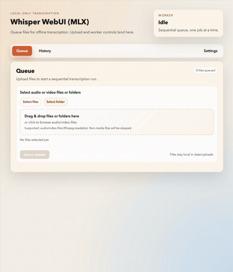

# mlx-ui

Local-only Web UI for running whisper-turbo-mlx on macOS Apple Silicon. Upload
audio or video files, process them sequentially with `wtm`, and download the
results from a queue + history view.

## Demo


## Origin / inspiration
This repo’s core idea and MLX backend flow are based on JosefAlbers’s
`whisper-turbo-mlx` project:
```text
https://github.com/JosefAlbers/whisper-turbo-mlx
```

## Features
- Localhost-only FastAPI UI for batch uploads
- Sequential worker (one job at a time)
- Results saved under `data/results/<job_id>/` (at least `.txt`)
- SQLite job tracking in `data/jobs.db`
- Optional Telegram delivery of `.txt` results (best-effort)
- Startup update check (best-effort, can be disabled)

## Requirements
- macOS Apple Silicon (arm64) for native MLX
- Internet access on first run (for Homebrew, Python, deps, model)
- Docker Desktop (optional, for the containerized CPU backend)

## Quick start
```bash
./run.sh
```
Then open http://127.0.0.1:8000.

The launcher will install (if missing): Xcode Command Line Tools, Homebrew,
Python 3.12, ffmpeg, Python deps, and whisper-turbo-mlx. The first run also
downloads model weights (can take a while).

## Install via curl

You can install the app and a convenient launcher script with a single command:

```bash
curl -fsSL https://raw.githubusercontent.com/pvpshoot/whisper-webui-mlx/master/scripts/install.sh | bash
```

This will:

- Clone/update the repo under `~/.local/share/whisper-webui-mlx` (by default)
- Create a `whisper-webui-mlx` launcher in `~/.local/bin`

Make sure `~/.local/bin` is on your `PATH`, then you can start the app with:

```bash
whisper-webui-mlx
```

## Docker quick start (CPU backend)
Docker runs a CPU-only transcription backend (`openai-whisper`). This is slower
than MLX but works on any Docker host. For best performance on Apple Silicon,
use the native `./run.sh` flow. The MLX/`wtm` backend is **not** available in
Docker because it requires macOS + Metal.

```bash
./docker-run.sh
```

Then open http://127.0.0.1:8000.

Notes:
- Data, logs, and the Whisper model cache are persisted under `./data`.
- The script cleans up stopped containers for the same image to avoid junk build-up.
- Override settings with env vars (examples below).
- Use `DOCKER_PLATFORM=linux/amd64` on Intel hosts if you need to force a platform.

Example overrides:
```bash
WHISPER_MODEL=base PORT=9000 ./docker-run.sh
```
Note: `TRANSCRIBER_BACKEND=wtm` is not supported in Docker; use `whisper` or
run natively with `./run.sh` for MLX.

## Manual dev loop
```bash
make dev-deps
make run
```

Other useful commands:
```bash
make test
make lint
make fmt
```

## Configuration
- `WTM_PATH` - path to the `wtm` binary if a different one is on PATH
- `WTM_QUICK` - set to `1`/`true` to enable quick mode (default: `false`)
- `TRANSCRIBER_BACKEND` - `wtm` (default), `whisper`, or `fake`
- `WHISPER_MODEL` - Whisper model name (default: `large-v3-turbo`)
- `WHISPER_DEVICE` - `cpu` (default) or `cuda` if you extend the image
- `WHISPER_FP16` - set to `1`/`true` to enable fp16 (GPU-only)
- `WHISPER_CACHE_DIR` - override Whisper model cache directory
- `TELEGRAM_BOT_TOKEN` - optional, for Telegram delivery
- `TELEGRAM_CHAT_ID` - optional, for Telegram delivery
- `LOG_LEVEL` - logging verbosity (default: `INFO`)
- `LOG_DIR` - log directory (default: `data/logs`)
- `DISABLE_UPDATE_CHECK=1` - skip startup update check
- `UPDATE_CHECK_URL` - override update check URL
- `SKIP_MODEL_DOWNLOAD=1` - skip model download in `scripts/setup_and_run.sh`

## Data locations
- `data/uploads/` - uploaded files
- `data/results/` - transcription outputs by job ID
- `data/jobs.db` - SQLite job metadata
- `data/logs/` - log files for debugging
- `data/.cache/whisper/` - Whisper model cache (Docker backend)

## Notes
- The server binds to `127.0.0.1` only.
- After initial setup and model download, the app works offline.
- Telegram delivery and update checks are best-effort and never block the queue.
